# Guía de Instalación de N8N

## 📋 Descripción
N8N es una plataforma de automatización de flujos de trabajo (workflow automation) que permite conectar diferentes servicios y aplicaciones de manera visual y sin necesidad de programar.

## 🔧 Requisitos Previos

### Node.js
N8N requiere Node.js para funcionar. Asegúrate de tener instalado Node.js versión 18 o superior.

**Verificar si Node.js está instalado:**
```powershell
node --version
```

**Si no tienes Node.js instalado:**
1. Visita [nodejs.org](https://nodejs.org/)
2. Descarga la versión LTS (recomendada)
3. Ejecuta el instalador y sigue las instrucciones

## 🚀 Instalación de N8N

### Método 1: Usando npx (Recomendado)
Este método no requiere instalación global y siempre usa la versión más reciente:

```powershell
npx n8n
```


## 📁 Configuración del Directorio de Trabajo

1. **Crear directorio para N8N:**
   ```powershell
   mkdir C:\Users\TU_USUARIO\N8N
   cd C:\Users\TU_USUARIO\N8N
   ```

2. **Ejecutar N8N desde el directorio:**
   ```powershell
   npx n8n
   ```
### Verificar versión
```powershell
npx n8n --version
```


## 🌐 Acceso a la Interfaz Web

Una vez que N8N esté ejecutándose:

1. **URL de acceso:** http://localhost:5678
2. **Puerto por defecto:** 5678
3. **Abrir automáticamente:** Presiona `o` en la terminal para abrir el navegador

## 👤 Configuración Inicial

### Primera vez:
1. Abre tu navegador en http://localhost:5678
2. Crea tu cuenta de administrador
3. Configura tu nombre de usuario y contraseña
4. ¡Comienza a crear tus primeros workflows!

Instalar paquetes adicionales:

Instalar el paquete de n8n-nodes-oracle-cloud
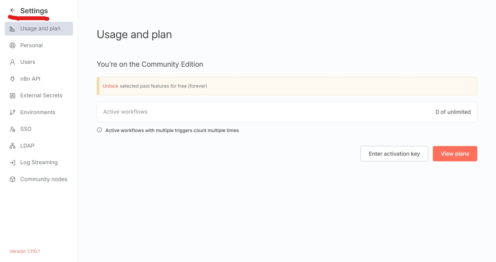

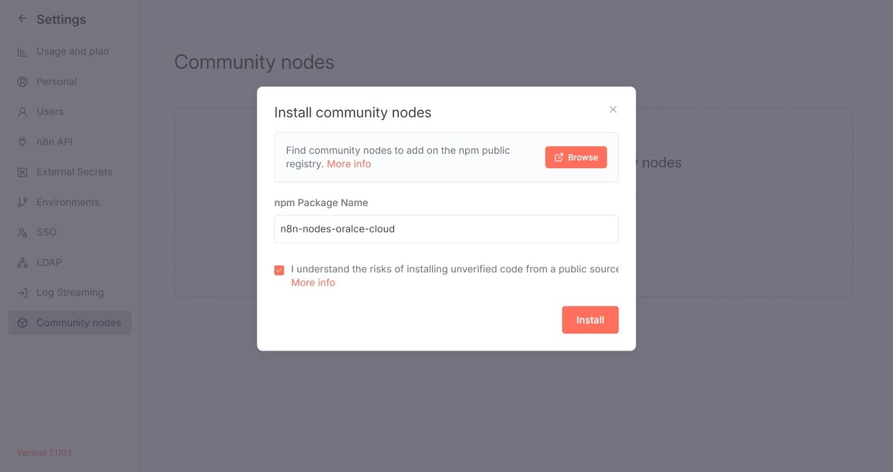

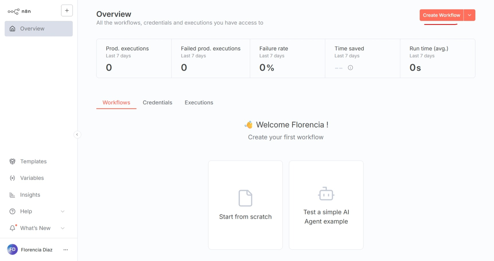

## 📸 Guía Paso a Paso

### 🔤 Workflow para Subir Archivos 
Crear workflow para subir archivos y usarlos como Knowledge Base:

#### 1. Inicio del workflow 
* Nodo: "On form submission"
* Configuración: Form para subir archivos con campo "Subir archivos"
* Elementos: File upload field, accepted file types (.jpg, .png), multiple files enabled
* Propósito: Crear formulario web para recibir archivos del usuario

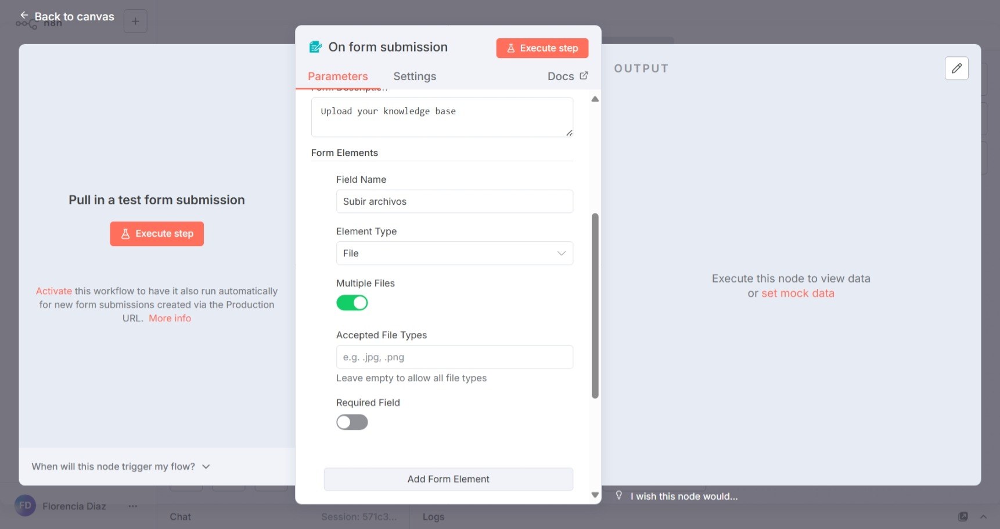

#### 2. Oracle Database Vector Store Insert
* Nodo: "Oracle Database Vector Store: Insert"
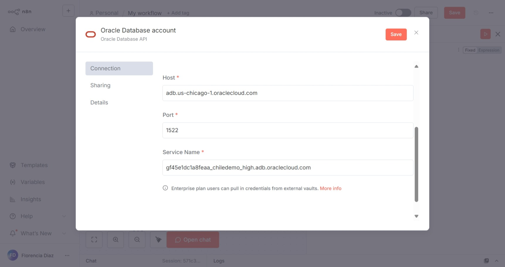

* Configuración: 
* user: 
* password: 
* Host:
* Port:
* Service Name:

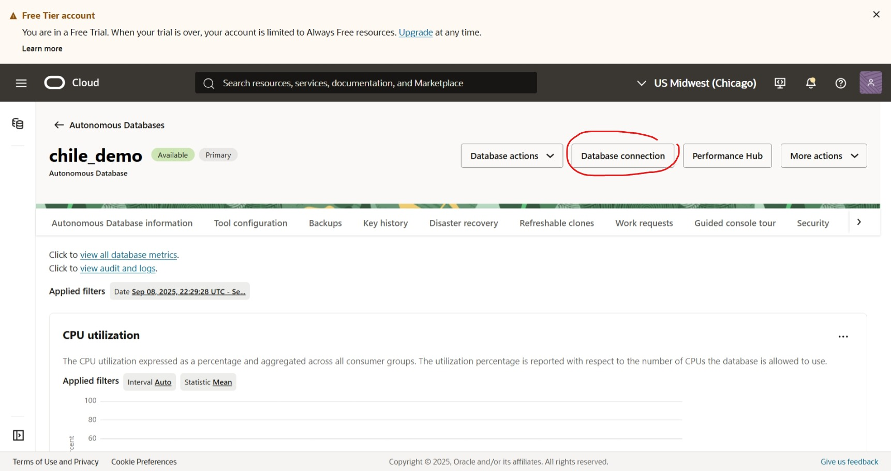

* Table Name: prueba_demos_chile
* Clear Table: Activado (limpia tabla antes de insertar)
* Propósito: Insertar documentos procesados en la base de datos vectorial

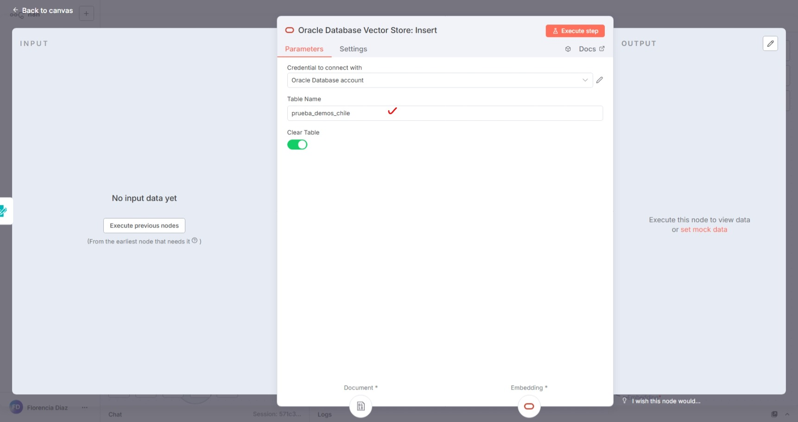

#### 3. Conexión de nodos Default Data Loader
* Nodo: "Default Data Loader"
* Type of Data: Binary
* Mode: Load All Input Data
* Data Format: Automatically Detect by Mime Type
* Text Splitting: Custom
* Options: Split Pages in PDF (activado)
* Propósito: Cargar y procesar archivos binarios, detectar formato automáticamente

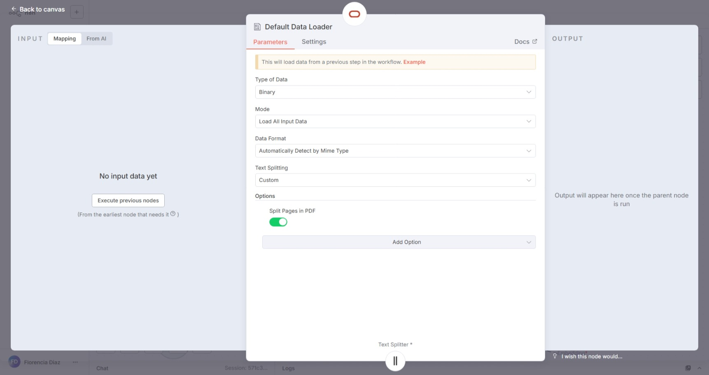

#### 4. Recursive Character Text Splitter
* Nodo: "Recursive Character Text Splitter"
* Chunk Size: 500
* Chunk Overlap: 25
* Options: No properties
* Propósito: Dividir texto en chunks manejables para embeddings

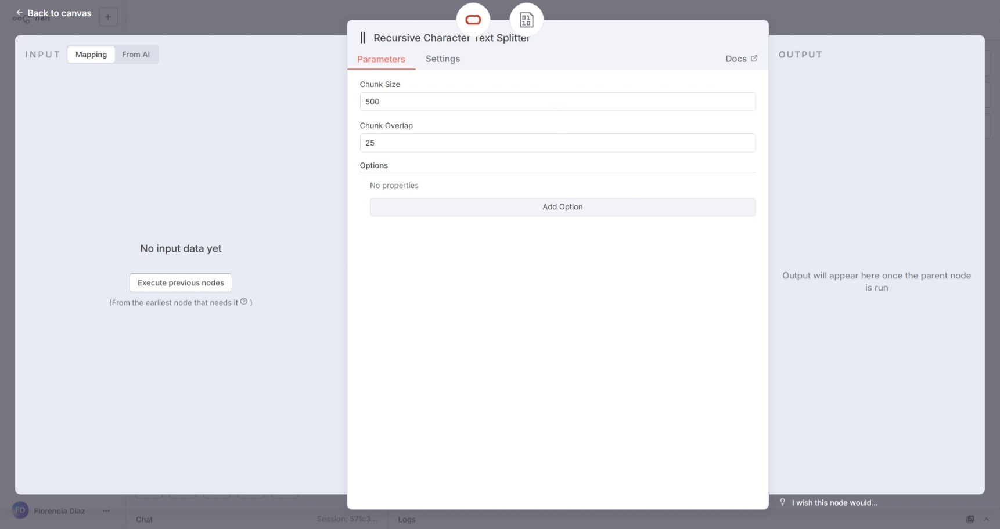

### 🔢 Creación del Agente IA 
Pasos completos para crear un agente IA con su propia base de datos:

**Nodos base del workflow**
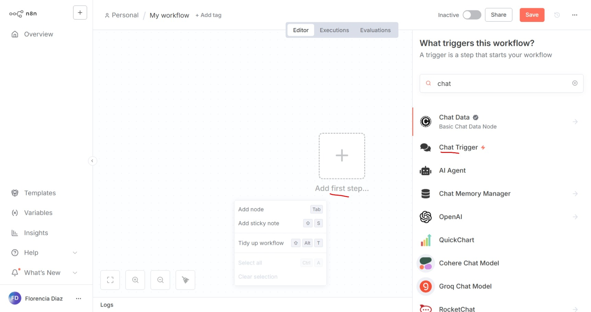

**Chat Responses (nodo inicial)**
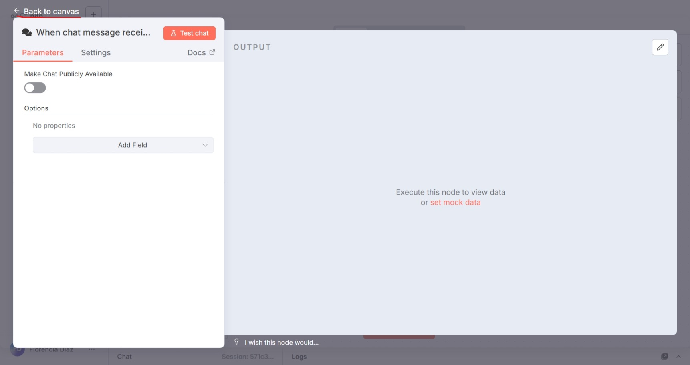

**AI Agent (configuración principal)**
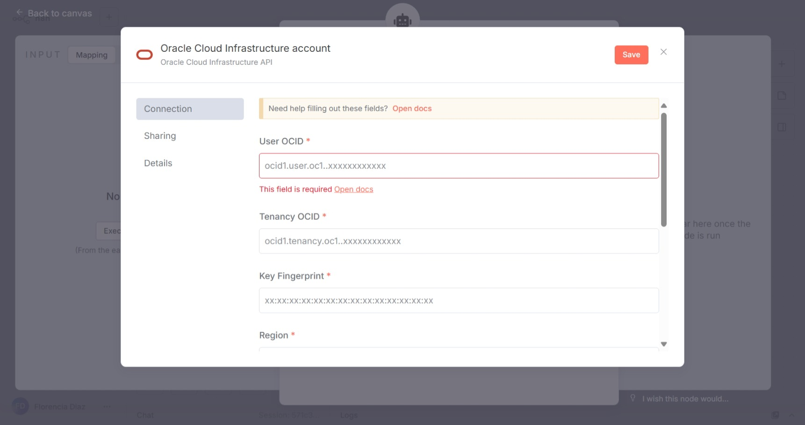
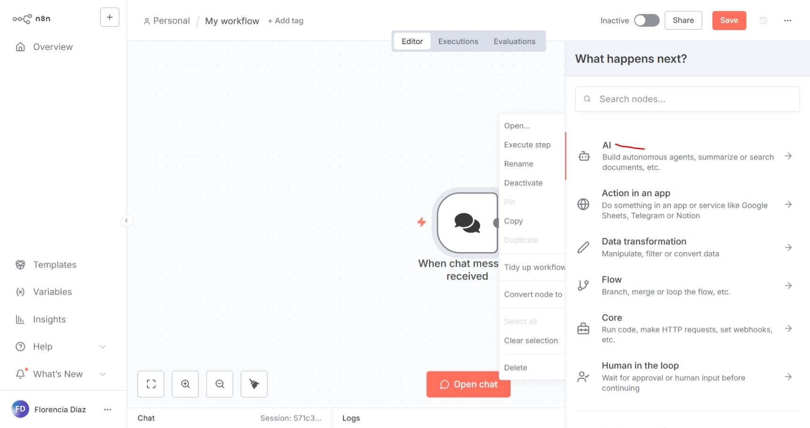

**OCI Generative AI Chat Model**
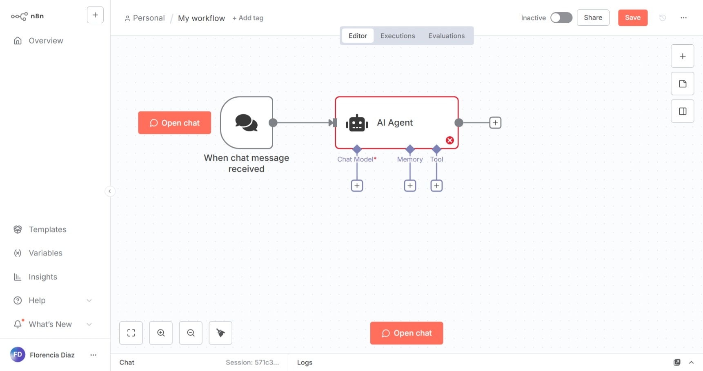

**Configuración de Tools/Herramientas**
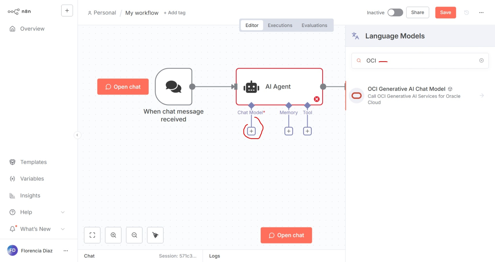

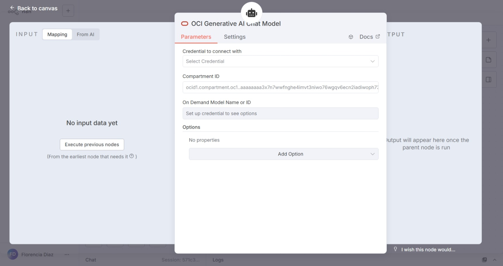

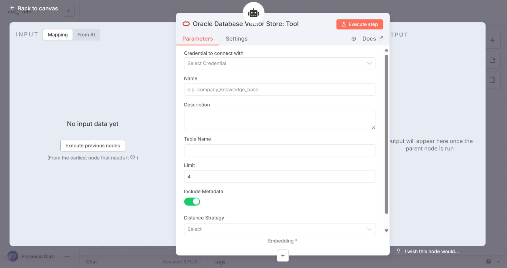


## 📚 Recursos Adicionales

- **Documentación oficial:** https://docs.n8n.io/
- **Comunidad:** https://community.n8n.io/
- **Templates:** https://n8n.io/workflows/
- **GitHub:**4. Ir a settings -> Community nodes

